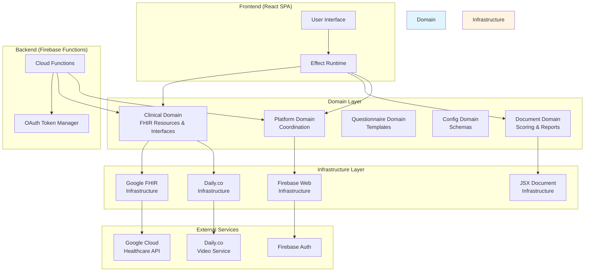
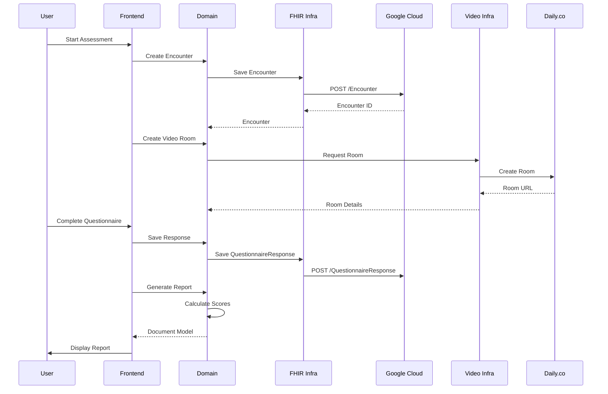

# Assessment.is

It's a uniquely human skill to look at another person, recognize things about them, and use what you've learned to help them. Diagnosticians, use psychology, structured interviews, and reports to do just that.

Assessment.is helps diagnosticians by
- Combine recorded interviews and structured notes: See exactly what was said to inspire a clinical judgment
- Integrate with other diagnostic tools: Your reports deserve better than a screenshot
- Producing reports automatically from encounter transcripts and notes: Spend more time with patients and less time compiling notes

## Overview

Assessment.is enables healthcare professionals to conduct virtual diagnostic assessments with structured questionnaires (like DIVA-2 for ADHD and GAD-7 for anxiety). All data is stored in FHIR R4 format via Google Cloud Healthcare API.

## System Architecture

### High-Level Component View



### Data Flow: Conducting an Assessment



### Package Dependencies

```mermaid
graph LR
    subgraph "Apps"
        Frontend[apps/frontend]
        Functions[apps/functions]
    end
    
    subgraph "Domain Packages"
        ClinicalD[clinical-domain]
        DocumentD[document-domain]
        QuestionnaireD[questionnaire-domain]
        PlatformD[platform-domain]
        ConfigD[config-domain]
    end
    
    subgraph "Infrastructure Packages"
        FhirI[google-fhir-infrastructure]
        VideoI[daily-co-infrastructure]
        FirebaseI[firebase-web-infrastructure]
        JSXDocI[jsx-document-infrastructure]
    end
    
    subgraph "Global Packages"
        Util[util]
        ReactUtil[react-util]
        ESLint[eslint-config]
        TSConfig[typescript-config]
        Prettier[prettier-config]
    end
    
    Frontend --> ClinicalD
    Frontend --> DocumentD
    Frontend --> PlatformD
    Frontend --> FhirI
    Frontend --> VideoI
    Frontend --> FirebaseI
    Frontend --> JSXDocI
    Frontend --> ReactUtil
    
    Functions --> ClinicalD
    Functions --> PlatformD
    Functions --> FhirI
    Functions --> VideoI
    
    DocumentD --> ClinicalD
    DocumentD --> QuestionnaireD
    
    QuestionnaireD --> ClinicalD
    
    PlatformD --> ConfigD
    PlatformD --> FhirI
    PlatformD --> Util
    
    FhirI --> ClinicalD
    FhirI --> ConfigD
    
    VideoI --> ClinicalD
    VideoI --> ConfigD
    
    FirebaseI --> ConfigD
    
    JSXDocI --> DocumentD
    
    style Apps fill:#e8f5e9
    style "Domain Packages" fill:#e1f5ff
    style "Infrastructure Packages" fill:#fff4e1
    style "Global Packages" fill:#f3e5f5
```

## Repository Structure

```
assessmentis/
├── apps/
│   ├── frontend/           # React SPA (React Router v7)
│   └── functions/          # Firebase Cloud Functions
├── domain/
│   ├── clinical-domain/    # FHIR resources & repository interfaces
│   ├── document-domain/    # Document generation & scoring logic
│   ├── questionnaire-domain/ # Questionnaire templates
│   ├── platform-domain/    # Platform-level abstractions
│   └── config-domain/      # Configuration schemas
├── infrastructure/
│   ├── google-fhir-infrastructure/     # Google Healthcare API client
│   ├── daily-co-infrastructure/        # Daily.co video integration
│   ├── firebase-web-infrastructure/    # Firebase client
│   ├── jsx-document-infrastructure/    # React document templates
│   └── google-meet-infrastructure/     # (Currently unused)
└── global/
    ├── util/               # Domain-agnostic utilities
    ├── react-util/         # React components & hooks
    ├── eslint-config/      # Shared ESLint rules
    ├── typescript-config/  # Shared TypeScript configs
    └── prettier-config/    # Shared Prettier config
```

## Key Technologies

- **Frontend**: React 19, React Router v7, Vite, Effect-TS, Tundra CSS
- **Backend**: Firebase Cloud Functions, Node.js 22
- **Data Storage**: Google Cloud Healthcare API (FHIR R4)
- **Video**: Daily.co
- **Auth**: Firebase Authentication
- **Type Safety**: TypeScript (strict mode), Effect Schema

## Core Concepts

### Domain-Driven Design

The codebase follows DDD principles with clear separation between:
- **Domain**: Pure business logic, types, interfaces (no infrastructure dependencies)
- **Infrastructure**: Concrete implementations of domain interfaces
- **Applications**: User-facing apps that compose domain + infrastructure

### Effect-TS

All async operations use Effect-TS for:
- Type-safe error handling
- Dependency injection via Layers
- Composable business logic
- Runtime context management

### FHIR R4 Compliance

All clinical data follows FHIR R4 specification:
- **Questionnaire**: Structured assessment definitions
- **QuestionnaireResponse**: Patient responses
- **Encounter**: Clinical sessions
- **Composition**: Document resources

## Getting Started

### Prerequisites

- Node.js 22.x
- npm 10.9.2+

### Installation

```bash
npm install
```

### Development

```bash
# Start all development servers
npm run dev

# Start frontend only
cd apps/frontend && npm run dev

# Start Firebase emulator
cd apps/functions && npm run serve
```

### Common Commands

```bash
npm run lint              # Lint all packages
npm run check-types       # Type check all packages
npm run test              # Run all tests
npm run build             # Build all packages
npm run format            # Format with Prettier
```

## Documentation

- **[CONTRIBUTING.md](./CONTRIBUTING.md)**: Development guidelines, patterns, and conventions
- **[copilot-instructions.md](./copilot-instructions.md)**: Detailed architecture and AI assistant guidance
- **Package READMEs**: Each package has its own README with specific guidelines

## Architecture Principles

1. **Domain First**: Business logic lives in domain packages, pure and testable
2. **Effect-TS Throughout**: Composable, type-safe operations with explicit error handling
3. **FHIR Compliance**: Strict adherence to FHIR R4 for all clinical data
4. **Repository Pattern**: Data access abstracted through interfaces
5. **Type Safety**: TypeScript strict mode + Effect Schema for runtime validation

## Contributing

See [CONTRIBUTING.md](./CONTRIBUTING.md) for:
- Code style and conventions
- Testing guidelines
- Effect-TS patterns
- Package-specific guidelines

## License

UNLICENSED - Private project
